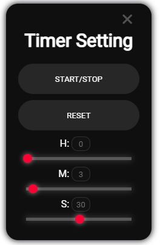

# Features
- Simple timer system
- Easy-to-use settings UI
- Sound notification when the timer ends

# Installation
- Download the zip file
- Extract the downloaded zip file
- Place `rnl-timer` in the `resource` folder
- Add `ensure rnl-timer` to `server.cfg`
- Restart the server

# Usage
Use the `/timer` command to show/hide the UI.  

### START/STOP
Toggles the timer start/stop.  
While the timer is running, the button can be pressed, but it will be temporarily disabled when the timer ends.  
This is to prevent issues.

### RESET
Resets the timer display.  
It will reset to either the default value set in the program or the time set when `START/STOP` was last pressed.

### H:
Sets the "hour" unit for the timer.  
You can adjust it using the input field next to the text or the slider below.  
Minimum: 0, Maximum: 23.

### M:
Sets the "minute" unit for the timer.  
You can adjust it using the input field next to the text or the slider below.  
Minimum: 0, Maximum: 59.

### S:
Sets the "second" unit for the timer.  
You can adjust it using the input field next to the text or the slider below.  
Minimum: 0, Maximum: 59.

# Dependencies
Confirmed:  
QBCore

# 特徴
- シンプルなタイマーシステム
- 簡単な設定UI
- タイマー終了時のサウンド

# インストール
- zipファイルをダウンロード
- ダウンロードしたzipファイルを展開
- `rnl-timer`を`resource`フォルダに導入
- `server.cfg`に`ensure rnl-timer`を追加
- サーバーを再起動

# 使用方法
`/timer`コマンドを使用してUIを表示/非表示

### START/STOP
タイマーの開始/停止を切り替えます。
タイマー再生中はボタンが押せますが、終了時、一時的にボタンが押せなくなります。
不具合回避のための無効化です。
### RESET
タイマーの時間表示をリセットします。
プログラム側で設定している初期値もしくは`START/STOP`を押したときに設定していた時間にリセットされます。
### H:
タイマーの"時"単位を設定します。
テキスト横の入力欄もしくは下のスライダーを変更することで設定できます。
最小値は0、最大値は23。
### M:
タイマーの"分"単位を設定します。
テキスト横の入力欄もしくは下のスライダーを変更することで設定できます。
最小値は0、最大値は59。
### S:
タイマーの"秒"単位を設定します。
テキスト横の入力欄もしくは下のスライダーを変更することで設定できます。
最小値は0、最大値は59。

# 依存
確認済み:
QBCore

# Download: [Github](https://github.com/Ram-0-0/rnl-timer)

# Preview: [Youtube](https://youtu.be/l8kEt_cGdX8)
